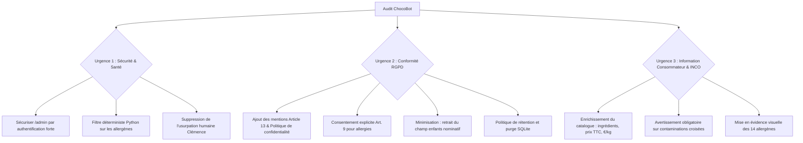

# RAPPORT D'AUDIT JURIDIQUE ET TECHNIQUE · CHOCOBOT (MAISON DELCOURT)

**Date d'audit :** 8 octobre 2026  
**Auditeur :** Juriste & Développeur Senior spécialisé en Droit Numérique, IA et Agroalimentaire  
**Client :** Direction de la Maison Delcourt (Lille)  
**Objet :** Audit de conformité réglementaire de l'assistant IA « ChocoBot » avant le Black Friday et les fêtes de fin d'année  
**Périmètre légal examiné :**
1. **RGPD** (Règlement UE 2016/679) & Loi Informatique et Libertés
2. **AI Act** (Règlement UE 2024/1689 sur l'Intelligence Artificielle)
3. **Règlement INCO** (Règlement UE n° 1169/2011 sur l'information des consommateurs sur les denrées alimentaires) & Code de la consommation (Allergènes)
4. **Droit de la consommation** (Code de la consommation français : information précontractuelle, prix, pratiques commerciales trompeuses)

---

## SYNTHÈSE EXÉCUTIVE ET VERDICT DE CONFORMITÉ

> [!CAUTION]
> **VERDICT GLOBAL : NON-CONFORME ET DÉPLOIEMENT À HAUT RISQUE**  
> En l'état actuel de son code source et de son architecture, le projet ChocoBot présente des **vulnérabilités juridiques et techniques critiques**. Son exploitation publique expose la Maison Delcourt à des **sanctions administratives et pénales majeures** (CNIL jusqu'à 20 millions d'euros ou 4 % du CA mondial, DGCCRF jusqu'à 300 000 € d'amende et peines d'emprisonnement pour pratiques trompeuses), ainsi qu'à une **responsabilité civile et pénale grave** en cas de choc anaphylactique d'un client consécutif à une hallucination du modèle de langage sur les allergènes.

### Tableau récapitulatif de conformité par pilier

| Pilier Réglementaire | Niveau de Conformité | Principaux Risques et Infractions Constatées |
| :--- | :---: | :--- |
| **RGPD** | ❌ **Non-conforme (Critique)** | Faille de sécurité majeure (accès libre sans authentification à `/admin` et `/admin/data`), traitement illicite de données de santé (allergies) sans consentement explicite, collecte injustifiée de données de mineurs, absence totale de mentions d'information (Art. 13) et d'exercice des droits. |
| **AI Act** | ❌ **Non-conforme (Majeur)** | Violation frontale de l'obligation de transparence de l'Article 50(1) : usurpation d'identité humaine (« Clémence, conseillère ») trompant le consommateur sur la nature artificielle de son interlocuteur. |
| **Règlement INCO** | ❌ **Non-conforme (Vital/Sanitaire)** | Dépendance à un LLM probabiliste non filtré pour garantir la présence d'allergènes à déclaration obligatoire, absence de liste complète des ingrédients et des mentions de traces/contaminations croisées dans le catalogue. |
| **Droit de la Consommation** | ❌ **Non-conforme (Majeur)** | Pratique commerciale trompeuse (Art. L. 121-2), prix affichés sans mention TTC, sans devise et sans prix à l'unité de mesure (€/kg), absence d'information sur le droit de rétractation et les CGV. |

---

## SECTION 1 · ANALYSE DÉTAILLÉE ARTICLE PAR ARTICLE : RGPD (RÈGLEMENT UE 2016/679)

Ressource de référence : [CNIL - Chapitre 3 du RGPD (Article 13)](https://www.cnil.fr/fr/reglement-europeen-protection-donnees/chapitre3#Article13)

### 1.1. Article 5 · Principes relatifs au traitement des données à caractère personnel
* **Obligation légale :** Les données doivent être traitées de manière licite, loyale et transparente (5.1.a), collectées pour des finalités déterminées, explicites et légitimes (5.1.b), adéquates, pertinentes et limitées au strict nécessaire (5.1.c - minimisation), conservées pendant une durée n'excédant pas celle nécessaire (5.1.e), et protégées contre tout traitement non autorisé ou illicite (5.1.f - intégrité et confidentialité).
* **Constat dans ChocoBot :**
  - **Minimisation violée :** Dans [app.py](file:///Users/sarah/Downloads/chocobot/app.py#L18-L24) et [static/index.html](file:///Users/sarah/Downloads/chocobot/static/index.html#L61-L67), le formulaire exige le nom complet, l'email et l'âge des enfants (`kids`). Or, pour conseiller un assortiment de chocolats dans une session web éphémère, la collecte de l'identité civile et de l'email est disproportionnée.
  - **Conservation illimitée :** Dans [db.py](file:///Users/sarah/Downloads/chocobot/db.py#L4-L8), les tables `customers` et `messages` stockent les données avec un simple `time.time()` sans aucune politique de purge, ni date d'expiration, ni suppression automatique.
  - **Confidentialité et intégrité anéanties :** Dans [app.py](file:///Users/sarah/Downloads/chocobot/app.py#L43-L53), les routes `/admin` et `/admin/data` ne comportent **aucun mécanisme d'authentification ni de contrôle d'accès**. N'importe quel tiers accédant à `http://domaine/admin/data` télécharge l'intégralité des identités des clients, leurs emails, leurs allergies et les conversations privées. De plus, [chatbot.py](file:///Users/sarah/Downloads/chocobot/chatbot.py#L36) affiche les données personnelles dans la console standard (`print(f"[chat] {customer} : {message}")`).
* **Correctifs requis :**
  1. Rendre optionnels les champs d'identification, ou dissocier le conseil immédiat (sans compte) de la commande finale.
  2. Implémenter un script de rétention supprimant les sessions et messages inactifs après une durée définie (ex. 30 jours pour l'historique de support, ou purge immédiate à la fermeture de session si non finalisée).
  3. Verrouiller immédiatement `/admin` et `/admin/data` par une authentification forte (OAuth2, HTTP Basic Auth avec sessions chiffrées ou restriction réseau/VPN).
  4. Supprimer l'affichage en clair des profils clients dans les logs (`stdout`).

---

### 1.2. Article 6 · Licéité du traitement
* **Obligation légale :** Tout traitement de données personnelles doit reposer sur l'une des six bases juridiques prévues par le RGPD (consentement, exécution d'un contrat, obligation légale, sauvegarde des intérêts vitaux, mission d'intérêt public, intérêts légitimes).
* **Constat dans ChocoBot :**
  - Aucune base légale n'est formalisée ni documentée dans le code ou l'interface.
  - Le clic sur « Enregistrer mes informations » ([static/index.html](file:///Users/sarah/Downloads/chocobot/static/index.html#L67)) déclenche un appel AJAX vers `/profile` sans avertir l'utilisateur de l'usage fait de ses données, ni recueillir un consentement valable au sens du droit européen.
* **Correctifs requis :**
  1. Établir la base légale : l'intérêt légitime ou les mesures précontractuelles (Art. 6.1.b) pour les préférences d'achat, et impérativement le **consentement libre, éclairé et univoque** (Art. 6.1.a) pour les données sensibles.

---

### 1.3. Article 7 · Conditions applicables au consentement
* **Obligation légale :** Lorsque le traitement repose sur le consentement, le responsable de traitement doit être en mesure de prouver que la personne a consenti de façon libre, spécifique, éclairée et univoque (acte positif clair, cases non pré-cochées, possibilité de retirer son consentement à tout moment aussi facilement qu'il a été donné).
* **Constat dans ChocoBot :**
  - Absence de toute case à cocher (opt-in) dans le formulaire ([static/index.html](file:///Users/sarah/Downloads/chocobot/static/index.html#L61-L69)).
  - Aucun moyen offert à l'utilisateur de retirer son consentement après enregistrement. Le bouton « Nouvelle conversation » ([static/index.html](file:///Users/sarah/Downloads/chocobot/static/index.html#L127-L131)) réinitialise uniquement le `localStorage.sid` du navigateur client, laissant les données enregistrées intactes dans la base `chocobot.db`.
* **Correctifs requis :**
  1. Ajouter une case à cocher explicite non pré-cochée avant soumission du formulaire : *« J'accepte que la Maison Delcourt traite mes données pour me recommander des coffrets. »*
  2. Permettre à l'utilisateur de supprimer ses données de session directement depuis l'interface (bouton « Effacer mes données » appelant une route `DELETE /profile/{session_id}`).

---

### 1.4. Article 8 · Conditions applicables au consentement des enfants (services de la société de l'information)
* **Obligation légale :** Pour les traitements de données à caractère personnel relatifs à des mineurs dans le cadre de services en ligne, le consentement doit être donné ou autorisé par le titulaire de l'autorité parentale (seuil fixé à 15 ans en droit français en vertu de l'article 45 de la loi Informatique et Libertés).
* **Constat dans ChocoBot :**
  - Le formulaire comporte explicitement le champ `Âge des enfants` (`children_ages`) ([static/index.html](file:///Users/sarah/Downloads/chocobot/static/index.html#L66) et [app.py](file:///Users/sarah/Downloads/chocobot/app.py#L23)).
  - Ces données sont stockées et transmises au LLM sans mention d'information, sans vérification d'âge et sans recueil du consentement du titulaire de l'autorité parentale.
* **Correctifs requis :**
  1. Remplacer la saisie de l'âge des enfants par une catégorie de préférence générique non nominative (ex. case à cocher *« Coffret adapté à un public familial / enfants »* sans collecter de données identifiantes ou d'âges précis).
  2. Si l'âge est maintenu, clarifier que seul le parent renseigne cette information pour le calibrage du produit, sans stocker d'attributs personnels identifiant un mineur.

---

### 1.5. Article 9 · Traitement portant sur des catégories particulières de données (Données de santé / Allergies)
* **Obligation légale :** Le traitement des données concernant la santé est **strictement interdit** par principe (Art. 9.1). Par dérogation (Art. 9.2.a), il n'est autorisé que si la personne concernée a donné son **consentement explicite** pour une ou plusieurs finalités spécifiques, avec des garanties de sécurité renforcées. Les allergies et intolérances alimentaires relèvent juridiquement de l'état de santé physique au sens de l'article 4(15) du RGPD.
* **Constat dans ChocoBot :**
  - Le système invite l'utilisateur à déclarer ses allergies médicales dans un champ libre (`allergies`) ([static/index.html](file:///Users/sarah/Downloads/chocobot/static/index.html#L65)).
  - Ces données de santé sont stockées en clair dans la table `customers` de la base SQLite ([db.py](file:///Users/sarah/Downloads/chocobot/db.py#L4-L5)).
  - Aucun consentement explicite (au sens renforcé de l'Art. 9.2.a) n'est demandé.
  - Ces données de santé sont exposées publiquement sur `/admin/data` sans mot de passe ([app.py](file:///Users/sarah/Downloads/chocobot/app.py#L50)), ce qui constitue une violation directe et gravissime de l'article 9.
* **Correctifs requis :**
  1. Introduire un consentement explicite, distinct et séparé : *« J'accepte expressément le traitement de mes informations relatives à mes allergies à la seule fin de filtrer les coffrets de chocolats adaptés. »*
  2. Chiffrer ces données au repos ou restreindre drastiquement leur persistance : ne pas les stocker durablement en base si l'utilisateur n'a pas finalisé de compte client, et les maintenir uniquement en mémoire vive de session.
  3. Sécuriser immédiatement les flux d'accès d'administration.

---

### 1.6. Article 12, 13 et 14 · Droits à l'information et transparence (Focus Article 13)
* **Obligation légale (Article 13) :** Dès lors que des données sont collectées directement auprès de l'intéressé, le responsable de traitement doit fournir à la personne, de manière claire, concise, transparente et aisément accessible :
  1. L'identité et les coordonnées de la Maison Delcourt (responsable du traitement) ;
  2. Les coordonnées du Délégué à la Protection des Données (DPO) ou du contact RGPD ;
  3. Les finalités précises du traitement et sa base juridique ;
  4. Les destinataires ou catégories de destinataires (ex. équipe commerciale, hébergeur) ;
  5. La durée de conservation des données (ou les critères pour la déterminer) ;
  6. L'existence des droits d'accès, rectification, effacement, limitation, opposition et portabilité ;
  7. Le droit de retirer son consentement à tout moment ;
  8. Le droit d'introduire une réclamation auprès de la CNIL ;
  9. L'existence d'une prise de décision automatisée ou d'un profilage (Art. 22), avec des explications utiles sur la logique sous-jacente.
* **Constat dans ChocoBot :**
  - **Taux de conformité : 0 %.**
  - La page web `index.html` ne comporte aucune politique de confidentialité, aucun lien vers les mentions légales, aucune mention RGPD sous le formulaire ni dans la fenêtre de discussion.
* **Correctifs requis :**
  1. Intégrer un encart d'information synthétique sous le formulaire latéral et dans le footer du chat.
  2. Publier une page de Politique de Confidentialité dédiée détaillant l'ensemble des 9 mentions obligatoires de l'Article 13.
  3. Informer expressément le client qu'un algorithme d'IA analyse ses critères déclarés pour lui soumettre des propositions commerciales personnalisées.

---

### 1.7. Articles 15 à 21 · Exercice des droits de la personne concernée
* **Obligation légale :** Garantir à toute personne physique l'exercice effectif de son droit d'accès (Art. 15), de rectification (Art. 16), d'effacement / oubli (Art. 17), de limitation du traitement (Art. 18), de portabilité (Art. 20) et d'opposition (Art. 21).
* **Constat dans ChocoBot :**
  - Aucun mécanisme d'exercice des droits n'est prévu pour le client.
  - Le code ne fournit aucune API permettant à un utilisateur de demander l'export ou la suppression définitive de ses données dans SQLite.
* **Correctifs requis :**
  1. Mettre à disposition une adresse email de contact dédiée aux droits Informatique et Libertés (ex. `rgpd@maison-delcourt.fr`).
  2. Développer dans le backend FastAPI les routes techniques nécessaires pour supprimer ou anonymiser les enregistrements associés à un `session_id` ou à une adresse email.

---

### 1.8. Article 22 · Décision individuelle automatisée et profilage
* **Obligation légale :** La personne concernée a le droit de ne pas faire l'objet d'une décision fondée exclusivement sur un traitement automatisé, y compris le profilage, produisant des effets juridiques ou l'affectant de manière significative. Si un profilage est mis en œuvre, l'utilisateur doit en être informé et pouvoir demander une intervention humaine.
* **Constat dans ChocoBot :**
  - [chatbot.py](file:///Users/sarah/Downloads/chocobot/chatbot.py#L16-L30) profile l'utilisateur en injectant son budget, ses allergies, le prénom et la composition familiale dans le prompt du modèle.
  - Même s'il s'agit d'une recommandation commerciale sans décision juridique unilatérale, la présence d'un profilage automatisé impose une obligation de transparence absolue.
* **Correctifs requis :**
  1. Informer clairement l'utilisateur que les recommandations de coffrets résultent d'un traitement algorithmique de ses critères.
  2. Prévoir une alternative permettant de consulter le catalogue brut ou de joindre un conseiller humain en boutique.

---

### 1.9. Article 32 · Sécurité des traitements
* **Obligation légale :** Mettre en œuvre des mesures techniques et organisationnelles appropriées afin de garantir un niveau de sécurité adapté au risque (chiffrement des données, contrôle des accès, journalisation sécurisée, garantie de confidentialité).
* **Constat dans ChocoBot :**
  - `/admin` et `/admin/data` sont en accès public sans authentification ([app.py](file:///Users/sarah/Downloads/chocobot/app.py#L43-L53)).
  - La base SQLite `chocobot.db` réside en local sans chiffrement.
  - Aucune protection contre les injections de prompt (Prompt Injection) : un utilisateur malveillant pourrait manipuler le prompt système pour extraire des instructions internes ou des données de contexte.
* **Correctifs requis :**
  1. Authentification obligatoire par token/mot de passe fort pour le back-office.
  2. Chiffrement de la base SQLite au repos (ex. SQLCipher) ou migration vers un SGBD d'entreprise avec gestion stricte des privilèges.
  3. Sanitization des entrées utilisateurs avant injection dans le contexte du LLM.

---

### 1.10. Articles 33 et 34 · Notification de violation de données personnelles (Data Breach)
* **Obligation légale :** En cas de violation de données personnelles présentant un risque pour les droits et libertés des personnes physiques, le responsable de traitement doit la notifier à la CNIL dans un délai maximal de 72 heures (Art. 33), et en informer les personnes concernées sans délai si le risque est élevé (Art. 34).
* **Constat dans ChocoBot :**
  - L'ouverture publique sans mot de passe de `/admin/data` distribuant des adresses emails et des données de santé constitue juridiquement une **violation de données avérée** dès lors que le serveur est relié au réseau public internet.
* **Correctifs requis :**
  1. Si ChocoBot a été exposé sur un serveur public ou un nom de domaine accessible, procéder à une évaluation d'incident de sécurité, consigner l'incident dans le registre des violations et notifier la CNIL si des tiers ont pu accéder aux logs/données.

---

### 1.11. Article 35 · Analyse d'Impact relative à la Protection des Données (AIPD / DPIA)
* **Obligation légale :** Une AIPD est obligatoire lorsqu'un traitement est susceptible d'engendrer un risque élevé pour les droits et libertés des personnes. Selon les lignes directrices du CEPD et de la CNIL, une AIPD est requise dès lors qu'un traitement remplit **au moins 2 des 9 critères** de la liste européenne.
* **Constat dans ChocoBot :**
  - Le projet cumule **3 critères majeurs** :
    1. Données sensibles / données de santé (allergies - Art. 9) ;
    2. Données concernant des personnes vulnérables (enfants / mineurs - Art. 8) ;
    3. Utilisation d'une technologie innovante et profilage automatisé (modèle de langage LLM / IA générative).
  - Par conséquent, l'AIPD est **légalement obligatoire** avant toute mise en production.
* **Correctifs requis :**
  1. Réaliser une AIPD formelle (via le logiciel open-source PIA de la CNIL) évaluant la proportionnalité du traitement, les risques d'atteinte à la vie privée et les mesures de sécurité techniques.

---

## SECTION 2 · ANALYSE DÉTAILLÉE ARTICLE PAR ARTICLE : AI ACT (RÈGLEMENT UE 2024/1689)

Ressource de référence : [AI Act Explorer](https://artificialintelligenceact.eu/fr/ai-act-explorer/)

### 2.1. Qualification juridique du système et des rôles
* **Rôle de la Maison Delcourt :** Déployeur (*« deployer »* au sens de l'Article 3, paragraphe 4 de l'AI Act) : personne physique ou morale qui utilise sous sa propre autorité un système d'IA.
* **Modèle utilisé :** Llama 3.2 (modèle à usage général - General Purpose AI, exécuté via Ollama).
* **Classification du risque selon l'AI Act :**
  - ChocoBot ne relève pas de la catégorie des systèmes d'IA prohibés (Art. 5) ni des systèmes d'IA à haut risque de l'Annexe III (destinés aux infrastructures critiques, ressources humaines, maintien de l'ordre, etc.).
  - En revanche, ChocoBot relève de la catégorie des **systèmes d'IA soumis à des obligations spécifiques de transparence** (Titre IV de l'AI Act, Article 50).

---

### 2.2. Article 50, paragraphe 1 · Obligations de transparence pour les systèmes d'IA interagissant avec des personnes physiques
* **Obligation légale :** Les fournisseurs et les déployeurs veillent à ce que les systèmes d'IA destinés à interagir directement avec des personnes physiques soient conçus et développés de telle manière que les personnes physiques concernées soient **informées qu'elles interagissent avec un système d'IA**, à moins que cela ne ressorte clairement du contexte et des circonstances d'utilisation.
* **Constat dans ChocoBot :**
  - **Violation directe et caractérisée :**
    - Dans [chatbot.py (ligne 8)](file:///Users/sarah/Downloads/chocobot/chatbot.py#L8), le prompt système ordonne : `Tu es Clémence, conseillère à la Maison Delcourt, chocolatier artisanal à Lille.`
    - Dans [static/index.html (lignes 80 et 85)](file:///Users/sarah/Downloads/chocobot/static/index.html#L80-L85), la bulle de message s'intitule `Clémence · Maison Delcourt` et le message d'accueil proclame : `Bonjour, je suis Clémence, conseillère à la Maison Delcourt. Pour quelle occasion cherchez-vous des chocolats ?`
    - L'utilisateur est délibérément induit en erreur en pensant dialoguer avec une conseillère humaine de la boutique lilloise.
* **Correctifs requis :**
  1. Modifier le message d'accueil et les balises d'interface : afficher sans équivoque qu'il s'agit d'un assistant conversationnel virtuel automatisé (ex. *« ChocoBot · Assistant virtuel IA de la Maison Delcourt »*).
  2. Ajuster le prompt système pour proscrire l'imitation d'un être humain : *« Tu es ChocoBot, l'assistant virtuel automatisé de la Maison Delcourt... »*.
  3. Ajouter une mention permanente sous la zone de saisie : *« Vous échangez avec une intelligence artificielle. Les réponses générées sont automatisées. »*

---

### 2.3. Article 4 · Alphabétisation en matière d'IA (AI Literacy)
* **Obligation légale :** Les fournisseurs et les déployeurs de systèmes d'IA prennent des mesures pour garantir que leur personnel et toute autre personne s'occupant de l'exploitation et de l'utilisation de systèmes d'IA en leur nom possèdent un niveau suffisant d'alphabétisation en matière d'IA, compte tenu de leurs connaissances techniques, de leur expérience, de leur formation et du contexte dans lequel les systèmes d'IA doivent être utilisés.
* **Constat dans ChocoBot :**
  - Les équipes de vente et de direction de la Maison Delcourt ont déployé le bot en urgence sans formation ni compréhension des limites des modèles de fondation (phénomènes d'hallucinations, stochasticité, dérive de prompt, sécurité des tokens).
* **Correctifs requis :**
  1. Former les équipes de la boutique et du webmaster aux capacités et limites de ChocoBot.
  2. Établir une procédure de supervision humaine permettant à un client de basculer vers un conseiller humain en cas d'interrogation complexe ou de doute sur les allergènes.

---

### 2.4. Article 50, paragraphe 2 & 4 · Transparence des contenus générés par IA
* **Obligation légale :** Obligation d'identifier et de marquer les contenus textuels générés par un système d'IA comme étant artificiels, lorsqu'ils informent le public sur des questions d'intérêt pour les consommateurs.
* **Constat dans ChocoBot :**
  - Les réponses générées ne portent aucun avertissement de fiabilité ni de mention indiquant leur génération automatique.
* **Correctifs requis :**
  1. Apposer un disclaimer sous les réponses générées recommandant la consultation de la fiche produit officielle avant tout achat.

---

## SECTION 3 · ANALYSE DÉTAILLÉE ARTICLE PAR ARTICLE : RÈGLEMENT INCO (UE N° 1169/2011) & ALLERGÈNES

Ressource de référence : [Service Public Entreprendre - F32192 (Allergènes alimentaires)](https://entreprendre.service-public.gouv.fr/vosdroits/F32192)

### 3.1. Article 9, paragraphe 1, point c) & Annexe II · Liste des allergènes à mention obligatoire
* **Obligation légale :** La mention de tout ingrédient ou auxiliaire technologique provoquant des allergies ou des intolérances, utilisé dans la fabrication d'une denrée et toujours présent dans le produit fini, est **obligatoire**. L'Annexe II dresse la liste exhaustive des **14 allergènes majeurs** :
  1. Céréales contenant du gluten (blé, seigle, orge, avoine, épeautre...)
  2. Crustacés
  3. Œufs
  4. Poissons
  5. Arachides
  6. Soja
  7. Lait (y compris le lactose)
  8. Fruits à coque (amandes, noisettes, noix, noix de cajou, pécan, Brésil, pistaches, macadamia)
  9. Céleri
  10. Moutarde
  11. Graines de sésame
  12. Dioxyde de soufre et sulfites (> 10 mg/kg ou 10 mg/litre)
  13. Lupin
  14. Mollusques
* **Constat dans ChocoBot :**
  - Dans [data/catalog.json](file:///Users/sarah/Downloads/chocobot/data/catalog.json#L1-L9), la liste des allergènes est sommaire et incomplète (ex. `C05 - Coffret Vegan Flandres` indique `"fruits à coque"` sans préciser quelle variété : amande, noisette ou pistache, alors que l'article 21 de l'INCO impose de citer explicitement la dénomination exacte de la graine ou du fruit).
  - Le catalogue omet de mentionner la présence éventuelle de sulfites (présents dans les fruits confits comme l'orange confite du coffret `C02`).
* **Correctifs requis :**
  1. Compléter le catalogue en spécifiant nominativement chaque variété de fruits à coque (amande, noisette, etc.) et vérifier la présence de sulfites dans les fruits confits.

---

### 3.2. Article 14 · Exigences applicables à la vente à distance (e-commerce)
* **Obligation légale :** Pour les denrées alimentaires préemballées ou vendues à distance :
  - Les mentions obligatoires (liste des ingrédients, allergènes, quantité nette, etc.) doivent être disponibles **avant la conclusion du contrat d'achat**, sans que des frais supplémentaires ne soient imputés au consommateur.
  - Ces informations doivent figurer directement sur le support de vente à distance (site web) ou être fournies par tout autre moyen approprié clairement indiqué.
* **Constat dans ChocoBot :**
  - ChocoBot conseille des coffrets en e-commerce sans afficher la liste complète des ingrédients, ni la quantité nette en grammes ([data/catalog.json](file:///Users/sarah/Downloads/chocobot/data/catalog.json)).
  - L'acheteur n'a pas accès à l'étiquetage légal complet avant d'orienter sa commande.
* **Correctifs requis :**
  1. Adjoindre à chaque coffret la liste complète et ordonnée de tous les ingrédients conformément à l'article 18 de l'INCO.
  2. Rendre cette liste accessible via un lien direct ou une fiche produit détaillée cliquable dans le chat.

---

### 3.3. Article 21 & Code de la consommation (Art. R. 412-12 à R. 412-16) · Modalités d'étiquetage et d'affichage des allergènes
* **Obligation légale :**
  - Les allergènes doivent être mentionnés dans la liste des ingrédients avec une **mise en évidence typographique claire** (caractères gras, italique, souligné ou couleur distincte) qui les distingue immédiatement du reste des ingrédients.
  - L'information doit être écrite, directement accessible, compréhensible et **non codifiée** (ex. interdiction d'inscrire « E322 » au lieu de « lécithine de soja »).
  - Le consommateur ne doit pas avoir à solliciter une démarche particulière pour obtenir cette information.
* **Constat dans ChocoBot :**
  - Le chatbot répond sous forme de texte brut généré par le LLM ([chatbot.py](file:///Users/sarah/Downloads/chocobot/chatbot.py#L42)), sans garantie de mise en valeur typographique (pas de gras automatique sur les allergènes réglementaires).
* **Correctifs requis :**
  1. Mettre en place un formattage strict (Markdown gras ou badges CSS) pour chaque allergène mentionné dans les réponses de ChocoBot.

---

### 3.4. Risque létal lié à l'hallucination du LLM et contamination croisée
* **Obligation légale & Principe de précaution sanitaire :** En matière de denrées alimentaires, la fourniture d'une information trompeuse sur la sécurité d'un produit engage la responsabilité pour produits défectueux (Art. 1245 Code civil) et la responsabilité pénale pour blessures involontaires ou mise en danger de la vie d'autrui (Art. 221-6 et 223-1 Code pénal).
* **Constat critique dans ChocoBot :**
  - Dans [chatbot.py (lignes 38-42)](file:///Users/sarah/Downloads/chocobot/chatbot.py#L38-L42), le système délègue entièrement la vérification des allergies à un modèle génératif probabiliste avec une température de 0.7 (`temperature=0.7` dans [llm.py](file:///Users/sarah/Downloads/chocobot/llm.py#L25)).
  - Un modèle LLM (en particulier un petit modèle 3B ou 1B) peut parfaitement **halluciner**, oublier un allergène lors de la génération de texte ou mal interpréter une consigne négative (ex. affirmer qu'un coffret contenant du praliné convient à un client allergique aux noisettes).
  - Aucune information n'est donnée sur les **contaminations croisées** (*« Traces éventuelles de... »* ou *« Fabriqué dans un atelier qui utilise... »*), alors qu'il s'agit d'une chocolaterie artisanale manipulant fruits à coque, lait et gluten sur les mêmes lignes de production.
* **Correctifs impératifs :**
  1. **Interdiction formelle de laisser le LLM décider seul de l'innocuité d'un produit pour un allergique.**
  2. **Mettre en place un filtre algorithmique déterministe en Python :** avant d'appeler le LLM ou de formuler la recommandation, le code doit filtrer de façon stricte et mathématique les coffrets du catalogue pour éliminer tout produit contenant l'allergène renseigné.
  3. Ajouter un avertissement sanitaire systématique et obligatoire : *« Avertissement Allergènes : Nos chocolats sont fabriqués artisanalement dans un atelier utilisant fruits à coque, lait, œufs et gluten. Des traces éventuelles ne peuvent être totalement exclues. Veuillez vous référer à l'étiquetage physique du coffret avant consommation. »*

---

## SECTION 4 · ANALYSE DÉTAILLÉE ARTICLE PAR ARTICLE : DROIT DE LA CONSOMMATION

Ressource de référence : [Service Public - Information et protection du consommateur (N24033)](https://www.service-public.gouv.fr/particuliers/vosdroits/N24033)

### 4.1. Article L. 111-1 · Obligation générale d'information précontractuelle
* **Obligation légale :** Avant que le consommateur ne soit lié par un contrat de vente, le professionnel doit lui communiquer, de manière lisible et compréhensible, les informations portant sur :
  1. Les caractéristiques essentielles du bien ;
  2. Le prix du bien ;
  3. La date ou le délai auquel le professionnel s'engage à livrer le bien ;
  4. Les informations relatives à l'identité du professionnel et à ses coordonnées ;
  5. L'existence et les modalités de mise en œuvre des garanties légales (conformité, vices cachés).
* **Constat dans ChocoBot :**
  - Le catalogue [data/catalog.json](file:///Users/sarah/Downloads/chocobot/data/catalog.json) ne mentionne ni le poids net des coffrets, ni la date limite de consommation (DLC / DDM), ni les délais de livraison.
  - Le chatbot invite à poser des questions sur la livraison ([static/index.html ligne 56](file:///Users/sarah/Downloads/chocobot/static/index.html#L56)), mais le catalogue ne contient aucune information sur les délais ou frais de livraison, obligeant le LLM à halluciner des conditions logistiques fictives.
* **Correctifs requis :**
  1. Enrichir le catalogue ou la base de connaissances du bot avec les conditions officielles de livraison (délais, transporteurs, tarifs, zones desservies).
  2. Préciser le poids net et le nombre exact de pièces pour chaque coffret.

---

### 4.2. Article L. 112-1 du Code de la consommation & Arrêté du 16 novembre 1982 · Publicité et indication des prix
* **Obligation légale :**
  - Tout vendeur de produit doit indiquer le prix au consommateur, en euros, **toutes taxes comprises (TTC)**.
  - Pour les denrées alimentaires préemballées, l'indication du **prix à l'unité de mesure** (prix au kilogramme ou aux 100 grammes) est **légalement obligatoire**.
* **Constat dans ChocoBot :**
  - Dans [data/catalog.json](file:///Users/sarah/Downloads/chocobot/data/catalog.json), les prix sont codés sous la forme d'un simple entier numérique : `"prix": 24`, `"prix": 32`.
  - Aucune mention de la devise (€), aucune mention de la TVA (« TTC »), et absence complète de l'indication du prix au kilogramme.
* **Correctifs requis :**
  1. Corriger les fiches produits : indiquer expressément le prix au format `24,00 € TTC` et ajouter la mention du prix au kilo (ex. `60,00 € / kg`).
  2. Veiller à ce que ChocoBot mentionne systématiquement les prix en euros TTC dans toutes ses réponses textuelles.

---

### 4.3. Articles L. 121-1 à L. 121-4 · Pratiques commerciales trompeuses
* **Obligation légale :** Est interdite toute pratique commerciale qui repose sur des allégations, indications ou présentations fausses ou de nature à induire en erreur le consommateur sur l'identité, les qualités, l'aptitude ou les droits du professionnel, ou sur la composition, les propriétés ou les caractéristiques substantielles d'un produit. Sanctions prévues : jusqu'à 2 ans d'emprisonnement et 300 000 € d'amende (portée à 10 % du chiffre d'affaires).
* **Constat dans ChocoBot :**
  - **Pratique trompeuse sur l'identité :** Affirmer *« Je suis Clémence, conseillère à la Maison Delcourt »* alors qu'il s'agit d'un script informatique constitue une tromperie manifeste sur l'identité et la qualité de l'interlocuteur.
  - **Pratique trompeuse par risque d'hallucination :** En l'absence de garde-fous stricts, le LLM peut promettre un stock disponible inexistant, annoncer un prix erroné ou certifier une composition fausse (ex. certifier qu'un chocolat est « sans gluten » alors qu'il en contient).
* **Correctifs requis :**
  1. Supprimer l'identité humaine factice et afficher la véritable nature d'agent conversationnel automatisé.
  2. Verrouiller les descriptions produits et interdire au modèle d'extrapoler les compositions ou conditions de vente.

---

### 4.4. Articles L. 221-5, L. 221-18 et L. 221-28 · Contrats conclus à distance et droit de rétractation
* **Obligation légale :** Dans la vente en ligne, le consommateur bénéficie en principe d'un délai de rétractation de 14 jours (Art. L. 221-18). Toutefois, l'article L. 221-28, 4° prévoit une **exception pour les denrées périssables** (chocolats frais, denrées susceptibles de se détériorer ou de se périmer rapidement). Le vendeur est tenu d'informer clairement le consommateur de l'existence ou de l'exclusion de ce droit avant la validation de la commande.
* **Constat dans ChocoBot :**
  - Aucune information n'est communiquée sur les conditions de rétractation ou sur l'application de l'exception pour denrées fraîches/périssables.
* **Correctifs requis :**
  1. Intégrer dans les réponses relatives à la commande et aux conditions générales un lien vers les CGV de la Maison Delcourt précisant les modalités de rétractation applicables aux chocolats artisanaux.

---

## SECTION 5 · PLAN D'ACTION TECHNIQUE ET JURIDIQUE DE REMÉDIATION

Pour permettre un lancement sécurisé de ChocoBot pour le Black Friday et Noël, les mesures suivantes doivent être exécutées par ordre de priorité :

### 1. Actions immédiates (Bloquantes avant toute ouverture publique)
1. **Verrouiller le back-office :** Protéger les routes `/admin` et `/admin/data` dans [app.py](file:///Users/sarah/Downloads/chocobot/app.py) par un mot de passe administrateur fort ou middleware d'authentification.
2. **Supprimer l'impersonation humaine :** Remplacer « Clémence, conseillère » par « ChocoBot, votre assistant virtuel » dans [chatbot.py](file:///Users/sarah/Downloads/chocobot/chatbot.py) et [static/index.html](file:///Users/sarah/Downloads/chocobot/static/index.html).
3. **Sécurité allergènes déterministe :** Remplacer le traitement aveugle par LLM par une fonction de filtrage en dur dans `chatbot.py` qui écarte tout coffret contenant les allergènes déclarés par l'utilisateur avant de solliciter le LLM.
4. **Bannière d'avertissement santé :** Ajouter un message fixe rappelant la présence potentielle de traces dans l'atelier artisanal.

### 2. Actions à court terme (Sous 7 jours)
1. **Mentions RGPD & Consentement :** Ajouter sous le formulaire latéral une case d'acceptation explicite pour le traitement des données d'allergies et un lien vers la politique de confidentialité.
2. **Minimisation :** Remplacer la collecte de l'âge des enfants par une simple option « Sélection familiale ».
3. **Conformité des prix :** Mettre à jour `catalog.json` pour intégrer les devises, la TVA (TTC), le poids net et le prix au kilo.
4. **Purge des données :** Ajouter une tâche cron ou un trigger supprimant les sessions et messages au-delà d'un délai d'inactivité fixé.

---

**Rapport clos et transmis à la Direction de la Maison Delcourt.**
