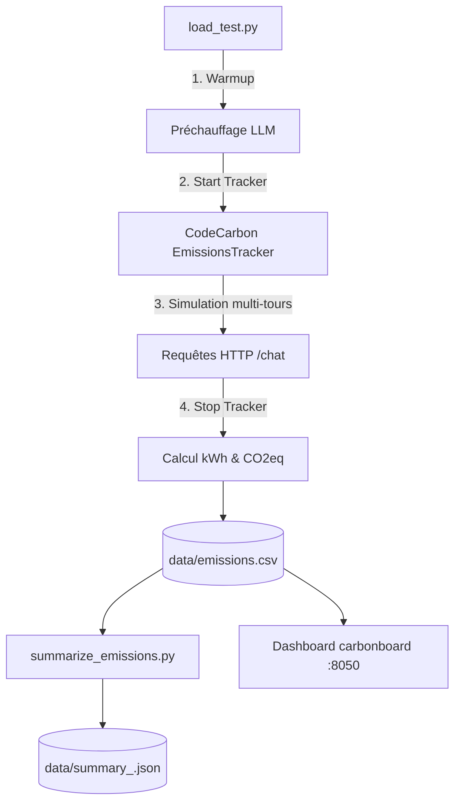

# Implémentation du Suivi de l'Empreinte Carbone avec CodeCarbon

## 1. Contexte & Sobriété Numérique
Conformément aux objectifs d'éco-conception et de sobriété numérique (Green IT), ChocoBot intègre un système d'évaluation de la consommation énergétique et des émissions de gaz à effet de serre (CO₂eq) via la bibliothèque **CodeCarbon (v3.3.1)**.

---

## 2. Architecture & Protocole de Mesure



### 1. Instrumentation du test de charge (`load_test.py`) :
* **Warmup préalable :** Un échange d'initialisation est envoyé pour exclure le temps de chargement du modèle en mémoire des mesures environnementales.
* **Tracker :** Initialisation de `EmissionsTracker(project_name="chocobot-baseline", output_dir="data", output_file="emissions.csv")`.
* **Mesures collectées :** Puissance processeur (CPU), RAM, GPU (si disponible), durée d'exécution, énergie consommée (kWh), émissions estimées (kg CO₂eq).

### 2. Synthèse statistique (`summarize_emissions.py`) :
Script Python analysant les derniers runs d'un projet pour produire des moyennes fiables et consolidées.

---

## 3. Résultats de Référence (Baseline)

D'après les 3 runs de référence (25 messages par run sur puce Apple Silicon M4) :

| Indicateur | Baseline (`chocobot-baseline`) |
| :--- | :--- |
| **Durée totale du run (25 msgs)** | ~ 140 s |
| **Énergie consommée** | ~ 0,46 Wh (0,00046 kWh) |
| **Émissions carbone par run** | ~ 0,026 g CO₂eq |
| **Émissions par message** | **~ 1,04 mg CO₂eq** |

Données enregistrées dans [`data/summary_chocobot-baseline.json`](file:///Users/amaury/MAISON_DELCOURT/data/summary_chocobot-baseline.json).

---

## 4. Commandes Utiles

### Lancer un test de charge instrumenté
```bash
python load_test.py 5
```
*(5 conversations de 5 messages = 25 messages)*

### Générer le rapport de synthèse
```bash
python summarize_emissions.py chocobot-baseline 25 3
```

### Visualiser le tableau de bord interactif
```bash
carbonboard --filepath data/emissions.csv --port 8050
```
*(Interface disponible sur `http://localhost:8050`)*
