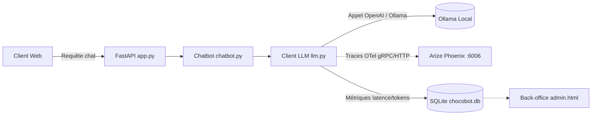

# Implémentation du Monitoring LLM avec Arize Phoenix

## 1. Contexte & Objectifs
Dans le cadre de l'exploitation de **ChocoBot**, il est indispensable de surveiller la performance, la fiabilité et le coût computationnel du modèle de langage (Llama 3.2 via Ollama). L'intégration d'**Arize Phoenix** fournit une observabilité complète (AI Observability) basée sur les standards ouverts **OpenTelemetry (OTel)**.

---

## 2. Architecture & Fonctionnement



### Composants implémentés :
1. **Instrumentation OpenTelemetry (`llm.py`) :**
   * Utilisation de `openinference-instrumentation-openai` et de `phoenix.otel.register`.
   * Enregistrement du projet sous le nom `chocobot`.
   * Capture automatique de chaque appel LLM (spans, prompts système, messages utilisateur, réponses générées).

2. **Persistance des métriques en base (`db.py`) :**
   * Création de la table `llm_metrics` :
     * `session_id`, `model`, `prompt_tokens`, `completion_tokens`, `total_tokens`, `latency_seconds`, `status`, `error_message`, `created_at`.
   * Fonctions dédiées :
     * `save_metric()` : enregistre les métriques brutes de chaque requête.
     * `get_stats()` : calcule en temps réel les totaux (tokens consommés, erreurs, latence moyenne).

3. **Tableau de bord d'administration (`static/admin.html`) :**
   * Compteurs temps réel : tokens consommés, latence moyenne en secondes, erreurs LLM.
   * Tableau des 50 dernières requêtes détaillées.
   * Lien direct vers le serveur Phoenix (`http://localhost:6006`).

---

## 3. Guide d'utilisation & Commandes

### Démarrer le serveur Phoenix
Dans un terminal dédié avec le venv activé :
```bash
phoenix serve
```
* **Interface Web :** `http://localhost:6006`
* **Collecteur OTLP (gRPC) :** `localhost:4317`
* **Collecteur OTLP (HTTP) :** `http://localhost:6006/v1/traces`

### Tester et visualiser les traces
1. Lancer l'application FastAPI (`uvicorn app:app --reload`).
2. Échanger avec le bot depuis `http://localhost:8000` ou exécuter un test de charge (`python load_test.py 2`).
3. Ouvrir `http://localhost:6006` pour analyser les traces, latences et tokens de chaque message.
